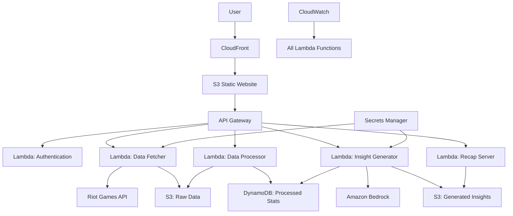

# Design Document

## Overview

The League of Legends Year in Review system is a serverless application built on AWS that creates personalized gaming recaps. The architecture follows event-driven patterns using AWS Lambda, API Gateway, and managed services to ensure scalability and cost-effectiveness. The system integrates with the Riot Games API to fetch match data, processes it using AWS analytics services, and generates AI-powered insights using Amazon Bedrock.

## Architecture

### High-Level Architecture



### Data Flow

1. **User Input**: Player provides summoner name and region through web interface
2. **Authentication**: Validate request and retrieve API credentials from Secrets Manager
3. **Data Fetching**: Retrieve summoner ID and match history from Riot API with rate limiting
4. **Raw Storage**: Store match data in S3 for durability and future processing
5. **Data Processing**: Transform raw matches into statistical insights and store in DynamoDB
6. **AI Generation**: Use Amazon Bedrock to create personalized narrative from statistics
7. **Insight Storage**: Cache generated insights in S3 for fast retrieval
8. **Presentation**: Serve formatted recap through API Gateway to frontend

## Components and Interfaces

### Frontend Components

**React Web Application**

- **SummonerInput**: Form component for summoner name and region selection
- **LoadingIndicator**: Progress display during data processing
- **RecapViewer**: Main component displaying year-in-review insights
- **StatisticsCharts**: Interactive charts using Chart.js or D3.js
- **ShareModal**: Social media sharing functionality with preview generation

### Backend Lambda Functions

**1. Authentication Handler (`auth_handler.py`)**

```python
from dataclasses import dataclass
from typing import Literal

@dataclass
class AuthRequest:
    summoner_name: str
    region: str

@dataclass
class AuthResponse:
    session_id: str
    status: Literal['valid', 'invalid']
```

**2. Data Fetcher (`data_fetcher.py`)**

```python
from dataclasses import dataclass
from typing import List, Dict, Any

@dataclass
class FetchRequest:
    session_id: str
    summoner_name: str
    region: str

@dataclass
class RiotApiResponse:
    summoner_id: str
    matches: List[Dict[str, Any]]
```

**3. Data Processor (`data_processor.py`)**

```python
from dataclasses import dataclass
from typing import List, Dict

@dataclass
class ChampionStat:
    champion_id: int
    champion_name: str
    games_played: int
    win_rate: float
    avg_kda: float

@dataclass
class MonthlyData:
    month: str
    games: int
    win_rate: float
    avg_kda: float

@dataclass
class ProcessedStats:
    total_games: int
    win_rate: float
    avg_kda: float
    champion_stats: List[ChampionStat]
    monthly_trends: List[MonthlyData]
```

**4. Insight Generator (`insight_generator.py`)**

```python
from dataclasses import dataclass

@dataclass
class GenerateRequest:
    session_id: str
    stats: ProcessedStats

@dataclass
class BedrockPrompt:
    player_stats: ProcessedStats
    template: str
```

**5. Recap Server (`recap_server.py`)**

```python
from dataclasses import dataclass
from typing import List, Dict

@dataclass
class ChartConfig:
    chart_type: str
    data: Dict
    options: Dict

@dataclass
class RecapResponse:
    narrative: str
    statistics: ProcessedStats
    visualizations: List[ChartConfig]
```

### API Gateway Endpoints

```
POST /api/v1/auth
  - Validates summoner and creates session

POST /api/v1/fetch
  - Triggers data fetching process
  - Returns job ID for status tracking

GET /api/v1/status/{jobId}
  - Returns processing status

GET /api/v1/recap/{sessionId}
  - Returns complete year-in-review data

POST /api/v1/share/{sessionId}
  - Generates shareable content
```

## Data Models

### DynamoDB Tables

**PlayerStats Table**

```json
{
  "PK": "PLAYER#{summonerId}",
  "SK": "STATS#{year}",
  "sessionId": "string",
  "totalGames": "number",
  "winRate": "number",
  "avgKDA": "number",
  "championStats": [
    {
      "championId": "number",
      "championName": "string",
      "gamesPlayed": "number",
      "winRate": "number",
      "avgKDA": "number"
    }
  ],
  "monthlyTrends": [
    {
      "month": "string",
      "games": "number",
      "winRate": "number",
      "avgKDA": "number"
    }
  ],
  "createdAt": "timestamp",
  "ttl": "timestamp"
}
```

**ProcessingJobs Table**

```json
{
  "PK": "JOB#{jobId}",
  "sessionId": "string",
  "status": "pending|processing|completed|failed",
  "progress": "number",
  "errorMessage": "string",
  "createdAt": "timestamp",
  "updatedAt": "timestamp",
  "ttl": "timestamp"
}
```

### S3 Data Structure

```
lol-year-review-bucket/
├── raw-data/
│   └── {summonerId}/
│       └── {year}/
│           └── matches-{timestamp}.json
├── processed-insights/
│   └── {sessionId}/
│       ├── narrative.json
│       └── visualizations.json
└── static-website/
    ├── index.html
    ├── assets/
    └── share-previews/
        └── {sessionId}.png
```

### Riot API Data Models

**Match Data Structure**

```python
from dataclasses import dataclass
from typing import List

@dataclass
class Participant:
    summoner_id: str
    champion_id: int
    kills: int
    deaths: int
    assists: int
    win: bool
    item0: int
    # ... additional match statistics

@dataclass
class MatchData:
    match_id: str
    game_creation: int
    game_duration: int
    participants: List[Participant]
```

## Error Handling

### Rate Limiting Strategy

- **Exponential Backoff**: Implement retry logic with exponential delays for Riot API calls
- **Circuit Breaker**: Temporarily halt requests if error rate exceeds threshold
- **Queue Management**: Use SQS for batch processing during high traffic periods

### Error Categories and Responses

**1. API Errors**

```python
from enum import Enum

class ApiErrorType(Enum):
    RATE_LIMITED = 'RATE_LIMITED'
    SUMMONER_NOT_FOUND = 'SUMMONER_NOT_FOUND'
    INSUFFICIENT_DATA = 'INSUFFICIENT_DATA'
    SERVICE_UNAVAILABLE = 'SERVICE_UNAVAILABLE'
```

**2. Processing Errors**

- **Data Validation**: Validate match data structure before processing using Pydantic models
- **Partial Failures**: Continue processing with available data if some matches fail
- **Timeout Handling**: Implement Lambda timeout management for long-running processes

**3. User-Facing Error Messages**

```python
from enum import Enum

class ApiErrorType(Enum):
    RATE_LIMITED = 'RATE_LIMITED'
    SUMMONER_NOT_FOUND = 'SUMMONER_NOT_FOUND'
    INSUFFICIENT_DATA = 'INSUFFICIENT_DATA'
    SERVICE_UNAVAILABLE = 'SERVICE_UNAVAILABLE'

ERROR_MESSAGES = {
    ApiErrorType.SUMMONER_NOT_FOUND: "We couldn't find that summoner name. Please check spelling and region.",
    ApiErrorType.INSUFFICIENT_DATA: "Not enough match history found. Try again after playing more games!",
    ApiErrorType.RATE_LIMITED: "Too many requests right now. Please wait a moment and try again."
}
```

## Testing Strategy

### Unit Testing

- **Lambda Functions**: Jest tests for each function with mocked AWS services
- **Data Processing**: Validate statistical calculations with known datasets
- **API Integration**: Mock Riot API responses for consistent testing

### Integration Testing

- **End-to-End Flows**: Test complete user journey from input to recap generation
- **AWS Service Integration**: Validate DynamoDB operations, S3 storage, and Bedrock calls
- **Error Scenarios**: Test rate limiting, API failures, and data validation

### Performance Testing

- **Load Testing**: Simulate concurrent users during hackathon demo
- **API Response Times**: Ensure sub-3-second response times for recap generation
- **Cost Monitoring**: Track AWS usage to stay within Free Tier limits

### Testing Infrastructure

```yaml
# GitHub Actions Workflow
name: Test and Deploy
on: [push, pull_request]
jobs:
  test-backend:
    runs-on: ubuntu-latest
    steps:
      - uses: actions/checkout@v2
      - name: Set up Python
        uses: actions/setup-python@v2
        with:
          python-version: "3.12"
      - name: Install Python dependencies
        run: |
          pip install -r requirements.txt
          pip install pytest pytest-cov moto
      - name: Run Python unit tests
        run: pytest tests/ --cov=src/
      - name: Run Python integration tests
        run: pytest tests/integration/

  test-frontend:
    runs-on: ubuntu-latest
    steps:
      - uses: actions/checkout@v2
      - name: Set up Node.js
        uses: actions/setup-node@v2
        with:
          node-version: "18"
      - name: Install Node dependencies
        run: npm install
      - name: Run React unit tests
        run: npm test
      - name: Build React app
        run: npm run build

  deploy:
    needs: [test-backend, test-frontend]
    runs-on: ubuntu-latest
    steps:
      - uses: actions/checkout@v2
      - name: Set up Python
        uses: actions/setup-python@v2
        with:
          python-version: "3.12"
      - name: Install Terraform
        run: |
          wget https://releases.hashicorp.com/terraform/1.6.0/terraform_1.6.0_linux_amd64.zip
          unzip terraform_1.6.0_linux_amd64.zip
          sudo mv terraform /usr/local/bin/
      - name: Deploy infrastructure
        run: |
          cd terraform/
          terraform init
          terraform plan
          terraform apply -auto-approve
        env:
          AWS_ACCESS_KEY_ID: ${{ secrets.AWS_ACCESS_KEY_ID }}
          AWS_SECRET_ACCESS_KEY: ${{ secrets.AWS_SECRET_ACCESS_KEY }}
```

### Monitoring and Observability

- **CloudWatch Dashboards**: Real-time metrics for Lambda performance and API usage
- **Custom Metrics**: Track business metrics like successful recap generations
- **Alerting**: SNS notifications for critical failures and cost thresholds
